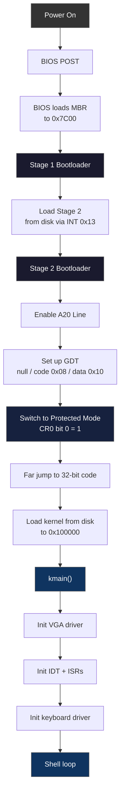

# NullOS

Custom x86 operating system built from scratch in assembly and C. No GRUB, no libraries, no training wheels -- just raw metal.

## Toolchain

| Tool | Purpose | Install |
|------|---------|---------|
| `nasm` | x86 assembler | `brew install nasm` |
| `i686-elf-gcc` | Cross-compiler (32-bit ELF) | `brew tap nativeos/i686-elf-toolchain && brew install i686-elf-gcc` |
| `qemu-system-i386` | x86 emulator | `brew install qemu` |
| `make` | Build automation | Pre-installed on macOS |

> **Important:** Do not use the system `gcc` -- it targets macOS Mach-O, not bare-metal ELF. The `i686-elf-gcc` cross-compiler is required.

## Build & Run

```bash
# Build the OS image
make

# Run in QEMU
make run

# Run with GDB debug stub on :1234
make debug

# Clean build artifacts
make clean
```

## Architecture Overview

### Memory Map

```
0x00000000 ┌──────────────────────────┐
           │ Real Mode IVT            │
0x00000500 ├──────────────────────────┤
           │ BIOS Data Area           │
0x00007C00 ├──────────────────────────┤
           │ Stage 1 Bootloader (512B)│  ← BIOS loads MBR here
0x00007E00 ├──────────────────────────┤
           │ Stage 2 Bootloader       │  ← Stage 1 loads this
0x00010000 ├──────────────────────────┤
           │ Stack (grows down)       │
0x0009FC00 ├──────────────────────────┤
           │ Extended BIOS Data Area  │
0x000B8000 ├──────────────────────────┤
           │ VGA Text Mode Buffer     │  ← 80×25 character display
0x00100000 ├──────────────────────────┤
           │ Kernel (loaded here)     │  ← kmain() entry point
           │ .text, .rodata, .data    │
           │ .bss, heap               │
0x00400000 ├──────────────────────────┤
           │ Free memory              │
           └──────────────────────────┘
```

### Boot Sequence



### Design Decisions

- **Flat memory model** -- GDT maps code and data segments across the full 4 GB address space
- **Ring 0 only** initially -- no user-mode separation until Phase 4
- **Custom bootloader** -- no GRUB dependency, full control over the boot process
- **Freestanding C** -- compiled with `-ffreestanding -nostdlib -nostdinc`, no libc

## Realistic Timeline

| Phase | What | Time Estimate |
|-------|------|---------------|
| Phase 1: Bootloader | Two-stage bootloader, GDT, A20 line, protected mode | 1 focused weekend |
| Phase 2: Kernel Basics | VGA text driver, keyboard input, basic shell | 2-3 sessions |
| Phase 3: Memory | Physical/virtual memory manager, paging, heap | 2-3 weeks |
| Phase 4: Multitasking | Process scheduler, context switching, syscalls | 3-4 weeks |
| Phase 5: Filesystem | FAT12/16 driver, VFS layer, disk I/O | 4-6 weeks |

**"Hello World" bootable OS in QEMU: ~1 week of evening sessions**

**Full OS with memory + multitasking + filesystem: months of steady work**

## Project Structure

```
NullOS/
  src/
    boot/
      stage1.asm          # First-stage bootloader (512 bytes, MBR)
      stage2.asm          # Second-stage (real mode → protected mode)
      gdt.asm             # Global Descriptor Table setup
      a20.asm             # A20 line enablement
    kernel/
      main.c              # Kernel entry point (kmain)
      vga.c               # VGA text-mode driver (80×25)
      idt.c               # Interrupt Descriptor Table
      keyboard.c          # PS/2 keyboard driver (IRQ1)
      shell.c             # Basic command shell
      memory.c            # Physical page allocator
      paging.c            # Virtual memory / paging
      heap.c              # kmalloc / kfree
      process.c           # Process management
      scheduler.c         # Round-robin scheduler
    drivers/
      serial.c            # Serial port (COM1) for debug output
      ata.c               # ATA/IDE disk driver
    lib/
      string.c            # string.h implementation
      printf.c            # Minimal printf
  include/                # Header files
  linker.ld               # Linker script (kernel at 0x100000)
  Makefile                # Build system
```

## Resources

- [OSDev Wiki](https://wiki.osdev.org/) -- the OS development bible
- [Intel Software Developer Manuals](https://www.intel.com/content/www/us/en/developer/articles/technical/intel-sdm.html)
- [Nick Blundell -- Writing a Simple OS from Scratch](https://www.cs.bham.ac.uk/~exr/lectures/opsys/10_11/lectures/os-dev.pdf)
- [James Molloy's Kernel Tutorial](http://www.jamesmolloy.co.uk/tutorial_html/)

## License

MIT
